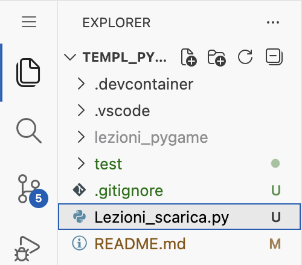

# 🎮 Laboratorio Pygame su GitHub Codespaces

Ambiente di sviluppo Python con Pygame, pronto all'uso nel browser.

## 🖥️ Accedere al desktop grafico

Pygame ha bisogno di una finestra grafica. Per aprirla:

1. Guarda in basso nella scheda **PORTS** (accanto a TERMINAL)
2. Trova la porta **6080** (noVNC)
3. Clicca sull'icona 🌐 per aprire noVNC nel browser
4. Se richiesta, inserisci la password: **pygame**

Si aprirà un desktop Linux nel browser.

## ▶️ Test dell'ambiente grafico

Nella finestra del desktop remoto (noVNC):

1. Clicca col tasto destro → **Applications → Terminal**
2. Digita:
```bash
cd /workspaces/*
python test/test_pygame.py
```
Usa le frecce direzionali per muovere il cerchio rosso.

## Scaricare le lezioni
1. Seleziona sulla sinitra il file Lezioni_scarica.py<br/>

2. Eseguire lo script python<br/>

3. Aprire sulla sinistra le lezioni contenute nella cartella **lezioni_pygame**


## 🔧 Risoluzione problemi

| Problema | Soluzione |
|----------|-----------|
| Desktop nero o non risponde | Ricarica la pagina noVNC |
| Porta 6080 non visibile | Attendi che il container finisca di avviarsi |

## 📚 Risorse

- [Documentazione Pygame](https://www.pygame.org/docs/)
- [Documentazione Pymunk](https://www.pymunk.org/en/latest/)
